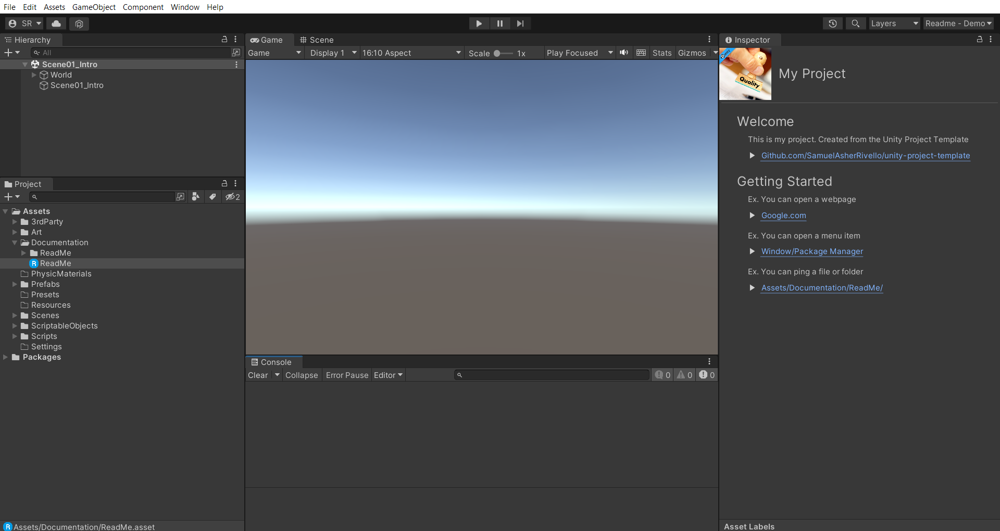

# Unity Project Template - Virtual Reality (VR)

This repo includes...

* Project Structure Best Practices from [SamuelAsherRivello/unity-project-template](https://github.com/SamuelAsherRivello/unity-project-template)
* C# Coding Standards for Unity from [SamuelAsherRivello/unity-project-template](https://github.com/SamuelAsherRivello/unity-project-template)
* Virtual Reality (VR) from [Meta's Oculus Quest 2](https://developer.oculus.com/documentation/unity/unity-gs-overview/)
* Custom Demo Scenes

 

 

**Getting Started**
1. Download this repo (*.zip or *.git)
1. Download the [Unity Editor](https://store.unity.com/#plans-individual)
1. Open this repo in the Unity Editor
1. Enjoy

 

 

### Videos

This **Unity Project** is featured in the following YouTube video playlist.

<table>
<tr>
<th>Unity Game Dev - In 3 Mins</th>
</tr>
<tr>
<td>

</td>
</tr>
</table>

 

 

### Features

This project is a living template. It showcases the best practices and coding standards for many common workflows.

**Includes Templates For** ...
* Git Repo - Structure, .gitignore, ReadMe.md
* Scene Hiearchy Window - Structure
* Project Window - Structure
* Inspector Window - ReadMe.asset
* Runtime Coding
* Editor Coding 
* Unit Testing 

 

 

### Overview

**Documentation**
* `ReadMe.md` - The primary documentation for this repo
* `Unity/Assets/Documentation/ReadMe.asset` - Select this asset in Unity to get started

**Configuration**
* `Unity Target` - [Standalone MAC/PC](https://support.unity.com/hc/en-us/articles/206336795-What-platforms-are-supported-by-Unity-)
* `Unity Version` - Use this [Version](./Unity/ProjectSettings/ProjectVersion.txt)
* `Unity Rendering` - [Standard Render Pipeline (SRP)](https://docs.unity3d.com/Manual/built-in-render-pipeline.html)
* `Unity Aspect Ratio` - [Game View 10x16](https://docs.unity3d.com/Manual/GameView.html)

**Structure**
* `Unity/` - Open this folder in the Unity Editor
* `Unity/Assets/Scenes/` - Open any Scene. Press 'Play'!

**Dependencies**
* `Various` - Already included via [Unity Package Manager](https://docs.unity3d.com/Manual/upm-ui.html) as this [Version](./Unity/Packages/manifest.json)

 

 

## Resources

Here are more from Samuel Asher Rivello.

**Portfolio**

- [SamuelAsherRivello.com/virtual-reality](SamuelAsherRivello.com/virtual-reality) - AR/VR/XR
- [SamuelAsherRivello.com/best-practices](https://www.SamuelAsherRivello.com/best-practices) - Proven approaches

**Medium Articles**

- [XR For Unity — 1 — Virtual Reality](https://samuel-asher-rivello.medium.com/xr-for-unity-1-virtual-reality-12dc0fe1d410)
- [XR For Unity — 2 — Augumented Reality](https://samuel-asher-rivello.medium.com/xr-for-unity-2-augmented-reality-144385b76a64)
- [XR For Unity — 3 — Mixed Reality](https://samuel-asher-rivello.medium.com/xr-for-unity-3-mixed-reality-11ba79e1c5b2)
- [Best Practices — 1 — Unity Project Structure](https://samuel-asher-rivello.medium.com/unity-project-structure-a694792cefed)
- [Best Practices — 2 — Unity C# Coding Standards](https://samuel-asher-rivello.medium.com/coding-standards-in-c-39aefee92db8)
- [Best Practices — 3 — Unity Overview](https://samuel-asher-rivello.medium.com/best-practices-3-unity-8abcce214ddc)
- [Best Practices — 4 — MVC Architecture For Unity](https://samuel-asher-rivello.medium.com/unleashing-the-power-of-mvc-architecture-in-unity-a-journey-of-structured-game-development-492ef9c53817)
- [Best Practices — 5 — Unit Testing For Unity](https://samuel-asher-rivello.medium.com/unity-testing-for-unity-elevating-your-game-development-skills-eb76fc0bbea3)

 

 

## Credits

Created By
=============

- Samuel Asher Rivello 
- Over 23 years XP with game development (2023)
- Over 10 years XP with Unity (2023)

Contact
=============

- Twitter - <a href="https://twitter.com/srivello/">@srivello</a>
- Resume & Portfolio - <a href="http://www.SamuelAsherRivello.com">SamuelAsherRivello.com</a>
- Git - <a href="https://github.com/SamuelAsherRivello/">Github.com/SamuelAsherRivello</a>
- LinkedIn - <a href="https://Linkedin.com/in/SamuelAsherRivello">Linkedin.com/in/SamuelAsherRivello</a> <--- Say Hello! :)

